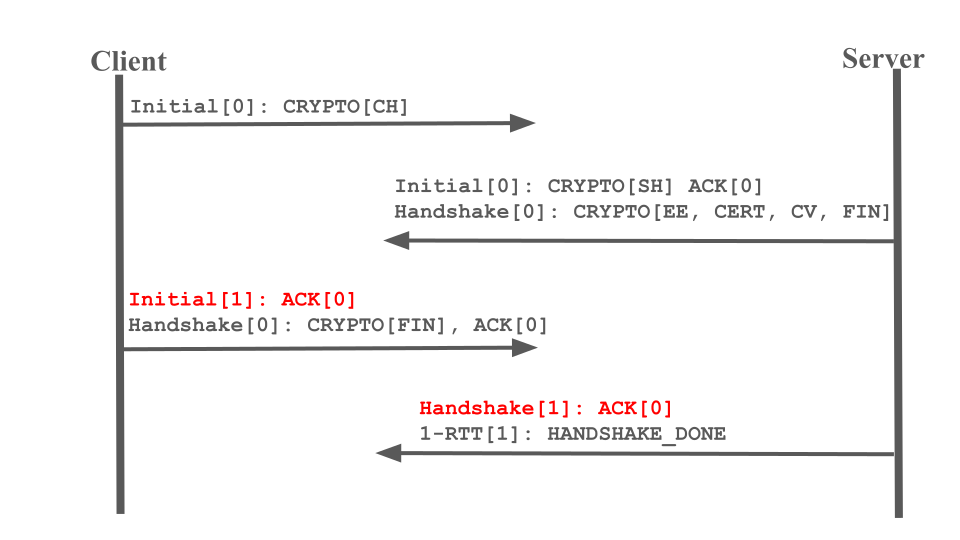

# Lab II-91: QUIC Handshake

## Overview

You should implement the QUIC handshake described in the RFC in this lab. Before this lab, we used an over-simplified version of the handshake, which involves only two Initial packets and changes almost nothing, excluding the intent to communicate between endpoints. In this lab, however, we need to use `Initial` and `Handshake` packets to deliver TLS handshake messages and exchange cryptographic keys between endpoints so they can authenticate and protect messages.

## Details

QUIC exchanges both cryptographic and transmission information during the handshake. But this lab requires only the cryptographic part. So transport parameters are not required to be encoded and sent as a TLS extension during the handshake.

As described in RFC, QUIC cooperates with TLS 1.3 implementations during the handshake. It embeds TLS messages in CRYPTO frames and transfers them on behalf of the TLS, while TLS provides securely exchanged secrets to QUIC. This lab doesn’t require payload encryption or header
protection using the exchanged secrets, though, i.e., all packets are still transmitted in plain text,
as we do before.

You need to embed one TLS 1.3 implementation in your QUIC implementation. Note that QUIC
requires some features in usual TLS implementations, such as retrieving the raw secrets. You had
better select a QUIC-aware TLS 1.3 implementation with the required APIs.
One recommendation is [picotls](https://github.com/h2o/picotls), which is relatively simple and validated by several industry-level QUIC implementations.

Typical TLS 1.3 implementations usually support more than one cipher suite, but only `TLS_AES_128_GCM_SHA256` is required for this lab. You could negotiate only this cipher in the Client Hello and assume that this must be the negotiated one in your code.
You also need to implement the packet number spaces feature, i.e., Initial, Handshake, and allremaining packets are sent in three number spaces. Packet number assignment, acknowledgment generations, and loss detection are independent in each packet number space. One possible problem is, when should I stop sending packets belonging to Initial or Handshake namespaces? In this lab, it's OK to stop sending Initial or Handshake when there are no more TLS messages of that encryption level to be transmitted. For example, two last ACKs (marked with red color as shown below) are optional.



You may need to generate self-signed certificates to test this feature. Note that the object name of the public certificate should be identical to the SNI in the ClientHello message. Otherwise, the certificate verification should fail.

## How this feature is checked


???+ warning "Help us"

    The testcase for this lab is currently unimplemented. Reach out to TA if you want to implement it and get the credits. If you are willing to help us with designing this test-case (including the grading script and / or the test application implementation) by pull requests, it will be greatly appreciated with extra credits.
    


We will run the ping-pong program as usual. In both endpoints, you should dump the exchanged secrets using the NSS key log format (`SSLKEYLOGFILE`). One example is shown below:

```text
SERVER_HANDSHAKE_TRAFFIC_SECRET
de4dd2b174920a7670975c0c135fea96ebfc5330aa2e737a81cf3bf867cd48d8
36016295cbad40bc9e92606e3d08806cf8da7511119d3643c74a4a1e75c77ef6
CLIENT_HANDSHAKE_TRAFFIC_SECRET
de4dd2b174920a7670975c0c135fea96ebfc5330aa2e737a81cf3bf867cd48d8
f71358dcea80c94b4b16b8514e30227f2c993cee7cfd15407d421f46defa2800
SERVER_TRAFFIC_SECRET_0
de4dd2b174920a7670975c0c135fea96ebfc5330aa2e737a81cf3bf867cd48d8
bd20a8a71b6228f805f6547495d8047f475f26a939d10904d1d1d6f809bcb062
CLIENT_TRAFFIC_SECRET_0
de4dd2b174920a7670975c0c135fea96ebfc5330aa2e737a81cf3bf867cd48d8
2cde713eacf98648b8e62081f46785077fcdfb0d9625cddd17c2451bbaa7c1d3
```


Note that one line is broken into three to fit in the space in the above example. You need to follow the format described [here](https://nss-crypto.org/reference/security/nss/legacy/key_log_format/index.html).

The path of the file to dump the key logs is stored on an environment variable SSLKEYLOGFILE.
We will compare key dumps on the client and the server to see whether they are valid and identical.
Packet traces are also checked to see if we could find critical TLS messages such as Client Hello,
Server Hello, and Certificate. It’s the responsibility of the TLS implementation to generate these messages. They work just well most of the time.

In our test environment, self-signed certificates are generated for hostname “server” and stored on the directory `/certs`.

